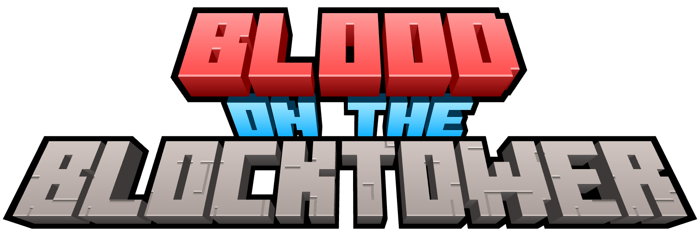
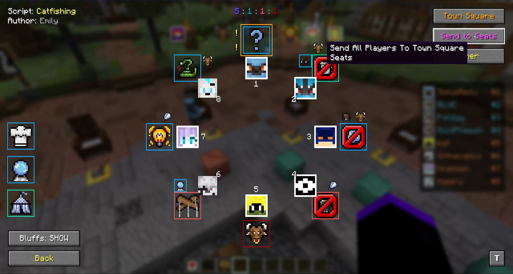
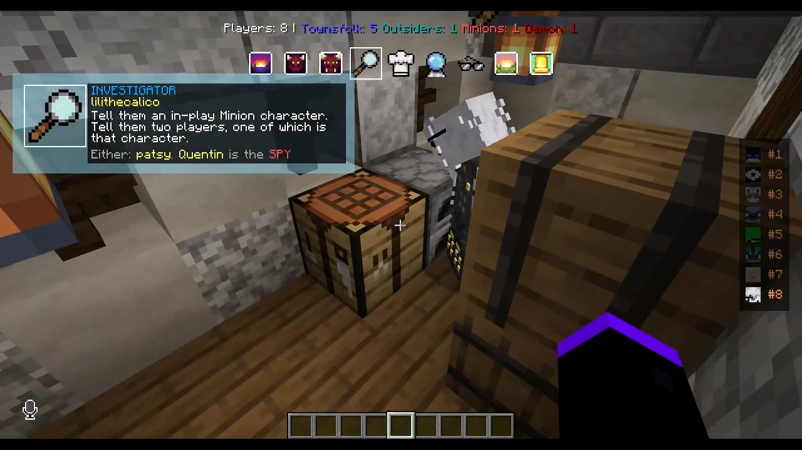
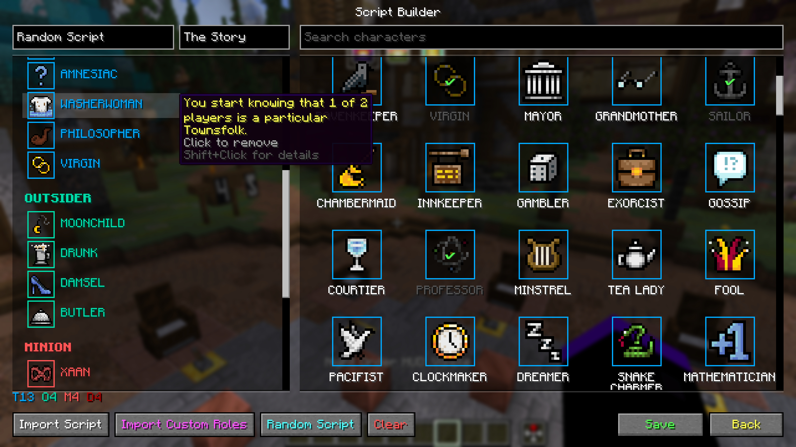
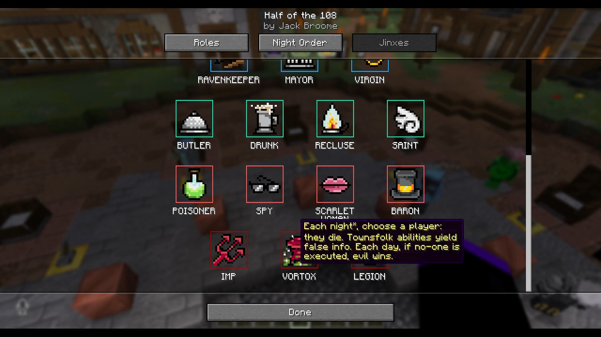
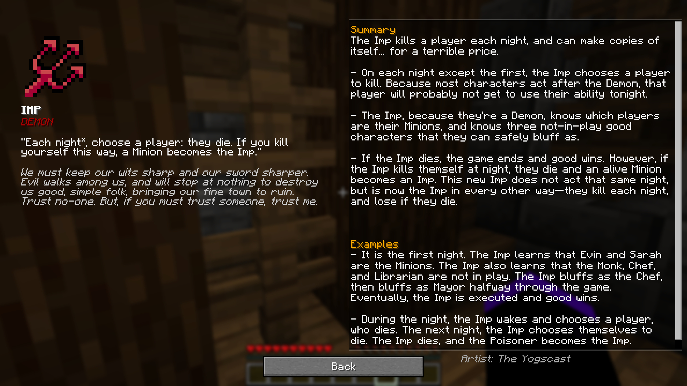
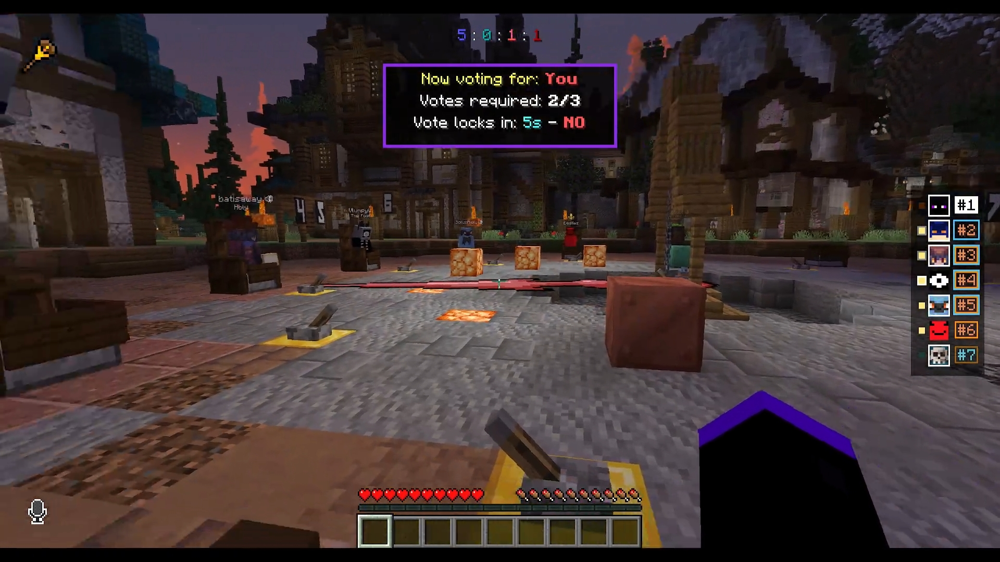

Modrinth
|
[CurseForge](https://www.curseforge.com/minecraft/mc-mods/blood-on-the-blocktower)
|
[Discord](https://discord.gg/xC6R88PVjC)
|
Wiki
|
[Credits](#credits)

    

# Overview
Blood on the Blocktower is a Minecraft adaptation of the fantastic social deduction game **Blood on the *Clocktower***. It allows you to easily setup and run the game on any map with your friends!

> Blood on the Blocktower is an unofficial fan project, not affiliated with or endorsed by The Pandemonium Institute.

## Download

[CurseForge](https://www.curseforge.com/minecraft/mc-mods/blood-on-the-blocktower/files)

Currently working on getting approval from other mod hosting sites.

## Dependencies
[Fabric API](https://modrinth.com/mod/fabric-api)

There is also voice chat integration, so **Highly Recommended:**
- [Simple Voice Chat](https://modrinth.com/plugin/simple-voice-chat)
- [Simple Voice Chat Enhanced Groups](https://modrinth.com/mod/enhanced-groups) (for isolated chat rooms)

This mod is client and serverside, so every player needs it.

## Videos

- [Trailer](https://www.youtube.com/watch?v=mMipITyFs-w)
- [Feature Rundown](https://www.youtube.com/watch?v=QnGgkdZCHuY)
- Setting up and running a game (coming soon!)

## Features

#### Storytelling
- Setup, sending roles
- Grimoire, reminders, management tools
- Visiting players, automatic night order management
- Daytime, nominations, and voting
- Fabled, Loric, Travelers, and exiles
- Timers, whisper settings
- In game script builder
- Simple Voice Chat integration
- Importing custom/homebrew roles and scripts

| Night helper HUD | Script builder |
|---|---|
|  |  |

#### Player reference
- Personal client-side grimoires for players
- Script reference, night order, jinxes
- Nominations and voting information (who can nominate and be nominated)
- Role details pages and examples

| Script reference | Role details |
|---|---|
|  |  |

## Important Notes

- Storytellers are defined as players with operator level 2 or higher. Players must not be operators!
- The server config is per world, at `<world-folder>/botb_server.json`
- Look through the "Advanced Guide" to understand how to run specific roles and special casing

## Setup

The video covers setup, but the overall process is:
1. Build a map
2. run `/botb setup`
3. assign players roles and activate Dusk to start the game (open the grimoire and look for the **T** button for keybind list)

Additional voice chat setup (highly recommended):
1. Create a persistent isolated voicechat group for each building
2. place a command block on the inside making players join the building group (define player homes above this block!)
3. place a command block on the outside making players leave the group

## Can I include this in my modpack?

**No. Not at this time.** I may relax this in the future, but for now, DO NOT redistribute my work, whether that be through a modpack or otherwise. The source is available to view, but this is NOT an open-source license.

## Bug Reports

Please file bugs as new issues. Currently not accepting PRs at this time, however, localization support is planned, and once that's added PRs for language localization will be encouraged!

## Credits

### Blood on the Clocktower

**Game design:** Steven Medway
**Published by:** The Pandemonium Institute

Names, abilities, and almanac text belong to The Pandemonium Institute and are used with permission. This mod is an unofficial and unaffiliated fan project. Play the official game at [bloodontheclocktower.com](https://bloodontheclocktower.com).

### The Yogscast

Nearly all of the role icons in this mod are by the fantastic folks at [The Yogscast](https://www.youtube.com/@yogscast), used with their permission. They were a huge inspiration for this mod, and their icons really bring the whole aesthetic together. Individual artist credit is on each role's details page.

### Thanks

An enormous thank you to Steven Medway and The Pandemonium Institute for making such an amazing game and fostering this great community, to The Yogscast for their fabulous icons, and to all the friends who came together each week to play and test the mod with me.
